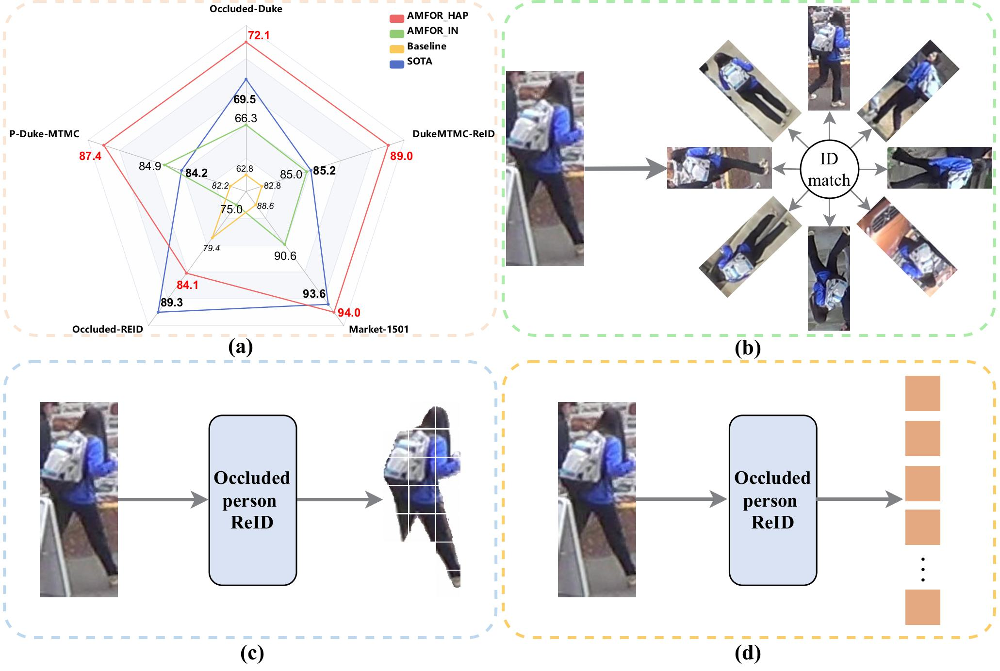
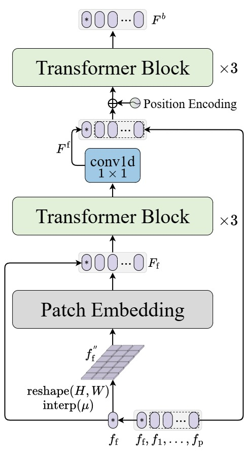

# AMFOR: Adaptive Multi-Granularity Fusion and Occlusion Reconstruction for Person Re-Identification 📚

## Introduction
  

## AMFOR framework
  

## AMFF-Encoder
  

## HPR-Decoder
  

## AMGDLoss
  

## News 🔥
- [2025.01] Update benchmark results
- [2025.01] Code will be released soon!

## Results 📊
### Benchmark Results(mAP/Rank-1)
|  Method  |  Occluded-Duke  |  Occluded-REID  |   P-Duke-MTMC   |   Market-1501   |  DukeMTMC-ReID  |
|:--------:|:---------------:|:---------------:|:---------------:|:---------------:|:---------------:|
|  AMFOR   |  **72.1/81.7**  |  **84.1/88.8**  |  **87.4/94.2**  |  **94.0/97.4**  |  **89.0/94.5**  |

## TODO
- [ ] Release training code
- [ ] Release pretrained models
- [ ] Add detailed documentation

## License
This project is licensed under the MIT License - see the [LICENSE](LICENSE) file for details.
