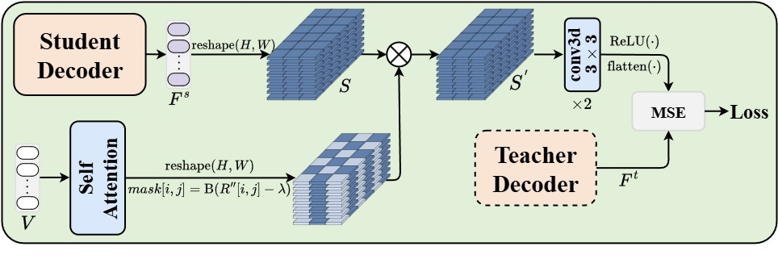

# AMFOR: Adaptive Multi-Granularity Fusion and Occlusion Reconstruction for Person Re-Identification 📚

**🎉 Accepted by IEEE Transactions on Multimedia 🎉**

---

## 📖 Abstract

Occluded person re-identification (ReID) poses substantial challenges in computer vision, primarily due to incomplete information and occlusion interference. Although Transformer architectures have become dominant in ReID due to their strong feature modeling capabilities, their lack of an adaptive weight allocation mechanism for multi-granularity feature processing limits their ability to extract generalizable and robust features. Recently, Masked Image Modeling (MIM) has demonstrated considerable promise in visual tasks, but its integration into ReID models remains underexplored. This paper presents **AMFOR** (Adaptive Multi-granularity feature Fusion and Occlusion Reconstruction), a novel framework combining MIM and Transformer architectures. AMFOR consists of three key components: AMFFEncoder, HPR-Decoder, and Teacher-Student Decoder. The AMFFEncoder enables adaptive fusion of multi-granularity features through learnable queries, allowing interaction between text-visual features and visual features extracted from multiple Transformer layers. The HPR-Decoder conceptualizes occluded regions in pedestrian images as reconstructable patches, guiding the encoder to extract more discriminative features through reconstruction. Additionally, the self-distillation teacher-student decoder is employed to refine pedestrian part features, further optimized by the proposed AMGDLoss.**This paper represents the first successful implementation of the MIM mechanism in person ReID models.** Empirical evaluations on five benchmark datasets, covering both occluded (Occluded-DukeMTMC, Occluded-REID, and PDukeMTMC-reID) and complete (Market-1501 and DukeMTMCreID) scenarios, demonstrate that AMFOR outperforms existing state-of-the-art methods in person ReID.

---

## 🏗️ Framework Overview

<em>Figure 1: Overview of the AMFOR framework for occluded person re-identification</em>

### 🔧 AMFOR Architecture

<em>Figure 2: Detailed architecture of the AMFOR framework</em>

### 🧩 Key Components

#### AMFF-Encoder

<em>Figure 3: Adaptive Multi-granularity Feature Fusion Encoder</em>

#### HPR-Decoder

<em>Figure 4: Human Part Reconstruction Decoder</em>

#### AMGDLoss

<em>Figure 5: Adaptive Multi-Granularity Distillation Loss</em>

---

## 📰 News 🔥

- **[2025.07]** 🎉 **Paper accepted by IEEE Transactions on Multimedia!**
- **[2025.01]** 📊 Update benchmark results
- **[2025.01]** 💻 Code will be released soon!

## 📊 Experimental Results

### 🏆 Benchmark Performance (mAP/Rank-1)

| **Method** | **Occluded-Duke** | **Occluded-REID** | **P-Duke-MTMC** | **Market-1501** | **DukeMTMC-ReID** |
| :--------------: | :---------------------: | :---------------------: | :--------------------: | :--------------------: | :---------------------: |
| **AMFOR** | **72.1/81.7** ⭐ | **84.1/88.8** ⭐ | **87.4/94.2** ⭐ | **94.0/97.4** ⭐ | **89.0/94.5** ⭐ |

> 🎯 **Key Achievements:**
>
> - **State-of-the-art performance** across all five benchmark datasets
> - **Superior results** on both occluded and complete person ReID scenarios
> - **First successful integration** of MIM mechanism in person ReID

---

## 📋 TODO List

- [ ] 🚀 Release training code
- [ ] 🤖 Release pretrained models
- [ ] 📚 Add detailed documentation
- [ ] 🔧 Provide installation guide

---

## 📄 License

This project is licensed under the MIT License - see the `<mcfile name="LICENSE" path="l:\AMFOR\LICENSE"></mcfile>` file for details.

---

**⭐ If you find this project helpful, please give it a star! ⭐**

